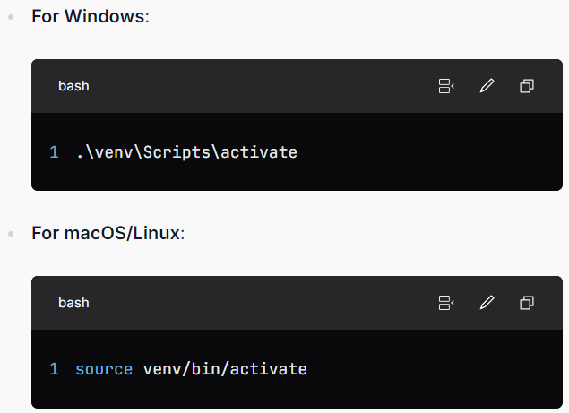
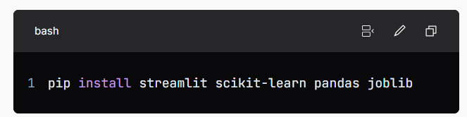

# Breast Cancer Data Analysis and Streamlit App

## Overview
This project focuses on the analysis of breast cancer data using a neural network model to predict whether a tumor is malignant or benign. It includes data preprocessing, feature selection, model construction using Artificial Neural Networks (ANN), and the development of an interactive web application using Streamlit.

## Features
- Data preprocessing to handle missing values and irrelevant features.
- Feature selection using SelectKBest to identify the most relevant features for prediction.
- Construction of an ANN model using the MLPClassifier from scikit-learn.
- Hyperparameter tuning through Grid Search Cross-Validation for optimal model performance.
- An interactive Streamlit application that allows users to input feature values and receive predictions.

## Setup
To set up the project, follow these steps:

1. **(Optional) Create a Virtual Environment**:
   **Creating a virtual environment is optional but recommended for better dependency management. If you choose to create one, follow these commands:**
   ```bash
   python -m venv Name

2. (Optional) Activate the Virtual Environment: If you created a virtual environment, activate it using:



3. Install Required Packages: Since a requirements.txt file is not provided, manually install the necessary packages:



4. Run the Streamlit App: Launch the Streamlit application by running:


   
### Requirements
1. Python 3.x
2. Streamlit
3. scikit-learn
4. pandas
5. joblib


### Dataset
The project uses the scikit-learn Breast Cancer dataset, which includes:

Features: Thirty features such as area, perimeter, texture, and mean radius.
Target Classes:
0: Carcinogenic (malignant)
1: Non-cancerous (benign)

### Qualities
Data Preprocessing and Feature Selection
The project involves importing the breast cancer dataset, handling missing values, and using SelectKBest to choose the most relevant features.

ANN Model Construction and Assessment
The MLPClassifier from scikit-learn is used to build a neural network model. Grid Search Cross-Validation optimizes the model's hyperparameters to enhance performance.

Streamlit App for Predictions and User Interaction
Users can input feature values into an interactive web application that uses Streamlit to predict whether a tumor is benign or malignant.

### Project Structure

1. data_preparation.py: Loads and prepares the dataset.
2. feature_selection.py: Selects relevant features using SelectKBest.
3. model_selection.py: Uses Grid Search to tune the hyperparameters of the ANN model.
4. Breast_cancer_data.csv: The preprocessed dataset.
5. streamlit.py: Streamlit application for user interaction and predictions.

### Output

https://assignment4-ann-2k7sxi9nhe5j8p8hfe3ipq.streamlit.app/

### Preview
Here is a preview of the application:


